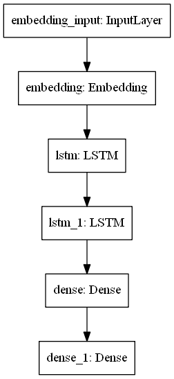
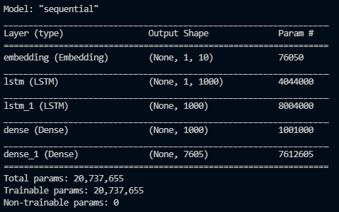
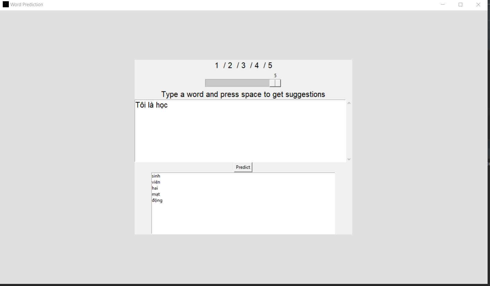

# AIP
# Next word predictor

Predicting what word comes next with Tensorflow. Implement RNN and LSTM

## About project
The project intended use is for Vietnamese language. Models will suggest the next word after user has input a word/words. This project database is used from Vietnamese literature books mainly.
## Methods used
- Language prediction
- Natural language processing
- RNN, LSTM

## Technology
- Python
- Tensorflow, keras

## Project description
- train.py : train model.
- main.py: innitiate model.
- run.py: graphical interface.

## Demonstration:

